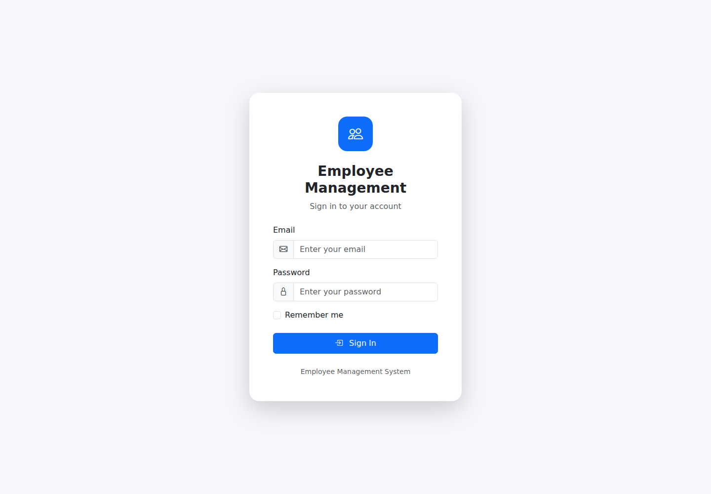
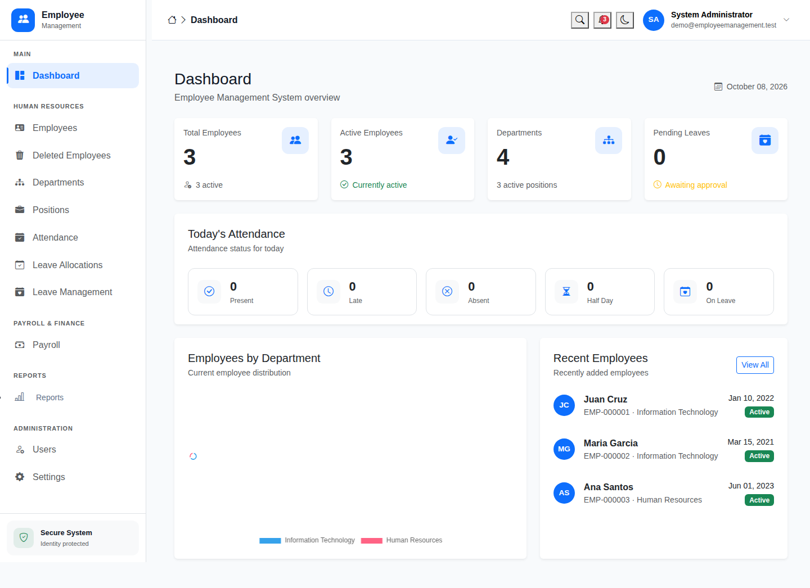
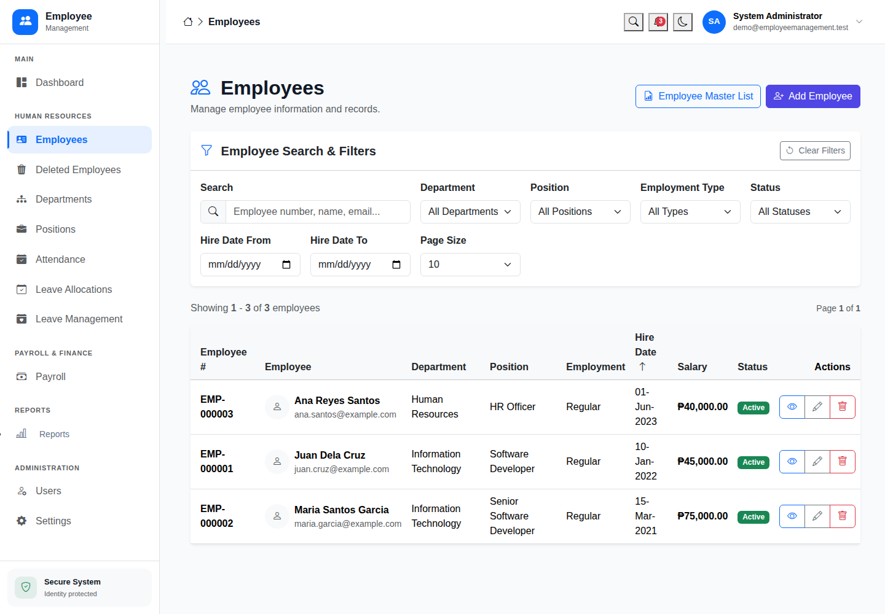
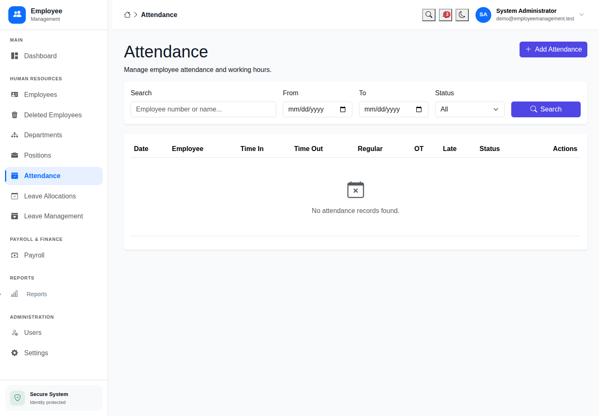
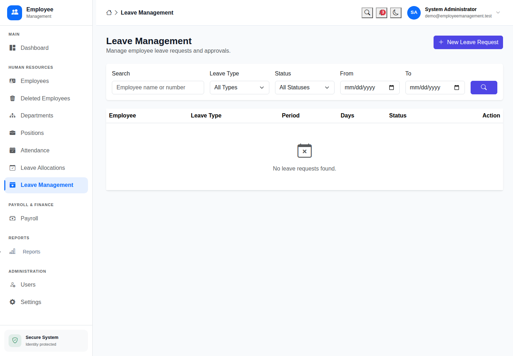
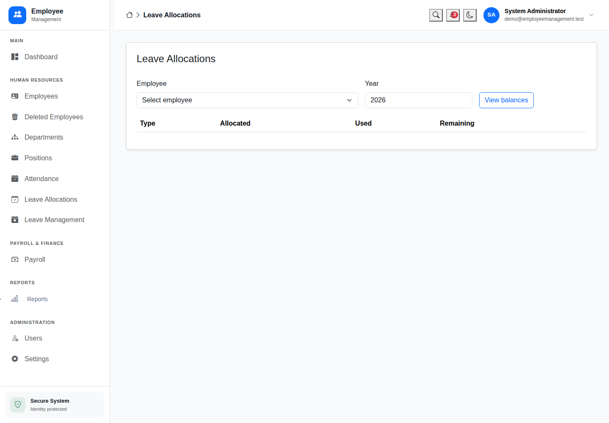
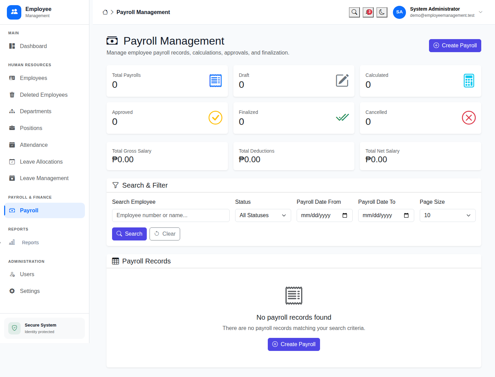
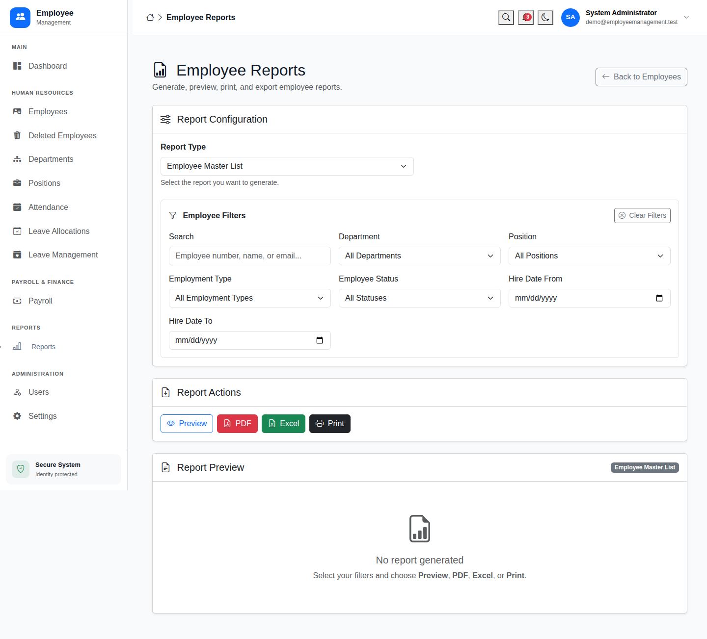

# Employee Management System

An ASP.NET Core MVC application for managing employees, departments, positions, attendance, leave allocations and payroll periods. Built with C#, .NET 10, SQL Server and Entity Framework Core.


## Features

| Module | Capabilities |
| --- | --- |
| Dashboard | Employee summaries, department counts and attendance indicators |
| Employees | Search, filters, paging, profiles, photo upload, archive and restore |
| Organization | Departments, positions and department-specific position selection |
| Attendance | Time in/out, late and undertime calculation, duplicate prevention |
| Leave | Annual allocations, requests, approval, rejection and cancellation |
| Payroll | Configurable deductions, payroll periods, lifecycle actions and PDF payslips |
| Reports | Employee master list, summary, department/status groups and new hires; PDF/XLSX exports |
| Accounts | Identity authentication, roles, profile editing and password changes |
| Operations | Auditing, Serilog logging, conflict handling and read-only system settings |

## UI screenshots

<!-- UI_SCREENSHOTS_START -->
### Sign in



### Dashboard



### Employee management



### Attendance



### Leave management



### Leave allocations



### Payroll



### Employee reports


<!-- UI_SCREENSHOTS_END -->

## Technology stack

| Area | Technology |
| --- | --- |
| Backend | C#, ASP.NET Core MVC, .NET 10 |
| Persistence | Entity Framework Core 10, SQL Server |
| Authentication | ASP.NET Core Identity and role authorization |
| Frontend | Razor views, Bootstrap, JavaScript, jQuery and Chart.js |
| Documents | QuestPDF PDF generation and native XLSX export |
| Logging | Serilog |
| Tests | xUnit and EF Core InMemory workflow tests |
| Optional reporting | Crystal Reports in a separate Windows/.NET Framework host |

## Project structure

| Path | Purpose |
| --- | --- |
| `src/EmployeeManagement.Domain` | Entities and enums |
| `src/EmployeeManagement.Application` | Service interfaces and application models |
| `src/EmployeeManagement.Infrastructure` | EF Core, Identity, migrations and service implementations |
| `src/EmployeeManagement.Web` | MVC controllers, Razor views and static assets |
| `src/EmployeeManagement.CrystalReport` | Optional legacy Crystal Reports host |
| `tests` | Payroll and workflow regression tests |
| `tools/ui-screenshots` | Capture genuine UI screenshots and update this README |
| `docs` | Setup, upgrade, validation and publishing instructions |

Open `EmployeeManagement.slnx` for the main application. Use `EmployeeManagement.Windows.slnx` only when working with the optional Crystal Reports host.

## Quick start

**Requirements:** a .NET 10 SDK and a reachable SQL Server instance. Use a disposable demo database for portfolio screenshots. Node.js is needed only for the optional screenshot tool.

From the project root in PowerShell:

```powershell
$web = '.\src\EmployeeManagement.Web\EmployeeManagement.Web.csproj'
dotnet user-secrets set 'ConnectionStrings:DefaultConnection' 'Server=localhost\SQLEXPRESS;Database=EmployeeManagementDb;Trusted_Connection=True;MultipleActiveResultSets=true;TrustServerCertificate=True' --project $web
dotnet user-secrets set 'SeedAdmin:Email' 'your-admin@example.com' --project $web
dotnet user-secrets set 'SeedAdmin:Password' 'YOUR-OWN-STRONG-PASSWORD' --project $web

dotnet restore EmployeeManagement.slnx
dotnet build EmployeeManagement.slnx -c Release --no-restore
dotnet test EmployeeManagement.slnx -c Release --no-build
dotnet run --project .\src\EmployeeManagement.Web --launch-profile https
```

Open the URL printed by the application and sign in using your configured administrator. There is no built-in administrator password. Startup applies database migrations; read the [existing database upgrade instructions](docs/SETUP.md#existing-database-upgrade) before using an existing database.

For sample records on a new demo database:

```powershell
dotnet user-secrets set 'Database:SeedDemoData' 'true' --project $web
```

Turn demo seeding off after setup. User secrets and runtime employee uploads are excluded from Git.

## Screenshots and GitHub publishing

1. Start the application locally.
2. Follow [SCREENSHOTS.md](docs/SCREENSHOTS.md) to capture the real UI and populate the gallery.
3. Follow [GITHUB.md](docs/GITHUB.md) to publish source and screenshots to your repository.

## Validation status

GitHub Actions successfully built the .NET 10 solution and passed **22 tests** (8 unit tests and 14 integration tests). The screenshot workflow started the app against a fresh SQL Server 2022 demo database, applied startup migrations, signed in and captured eight UI pages.

[Build and test results](https://github.com/RowLee79/EmployeeManagement/actions/runs/37729515680) · [Demo UI capture](https://github.com/RowLee79/EmployeeManagement/actions/runs/37729515632)

Existing-database upgrades, full business workflows and deployment acceptance still require the checks in VALIDATION.md. In-memory tests do not prove SQL Server concurrency or unique-index enforcement.

```powershell
powershell -ExecutionPolicy Bypass -File .\scripts\Run-Checks.ps1
```

See [VALIDATION.md](docs/VALIDATION.md) for database and browser acceptance checks.

## Implementation boundaries

- Payroll uses configurable formulas. Contribution rates default to zero and withholding is disabled until configured. Attendance-derived pay, monthly salary proration and statutory payroll certification are not implemented.
- Leave counts Monday–Friday without a holiday calendar. Cross-year requests must be split.
- Employee-only accounts have profile/password access; a full self-service portal is not included.
- System settings are read-only. The native report provider supports all five report choices; the optional Crystal endpoint supports the original master list.

Full configuration, deployment and upgrade information is in [SETUP.md](docs/SETUP.md). Refactor details are in [CHANGELOG.md](docs/CHANGELOG.md).
